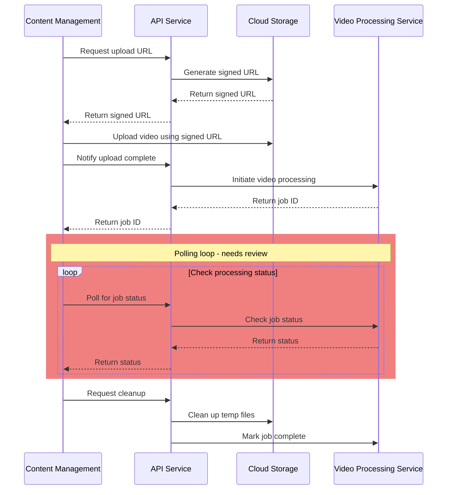

```mermaid
sequenceDiagram
    participant CM as Content Management
    participant API as API Service
    participant CS as Cloud Storage
    participant VP as Video Processing Service

    CM->>API: Request upload URL
    API->>CS: Generate signed URL
    CS-->>API: Return signed URL
    API-->>CM: Return signed URL
    CM->>CS: Upload video using signed URL
    CM->>API: Notify upload complete
    API->>VP: Initiate video processing
    VP-->>API: Return job ID
    API-->>CM: Return job ID

    rect rgb(240, 128, 128)
    Note over CM,VP: Polling loop - needs review
    loop Check processing status
        CM->>API: Poll for job status
        API->>VP: Check job status
        VP-->>API: Return status
        API-->>CM: Return status
    end
    end

    CM->>API: Request cleanup
    API->>CS: Clean up temp files
    API->>VP: Mark job complete
```
