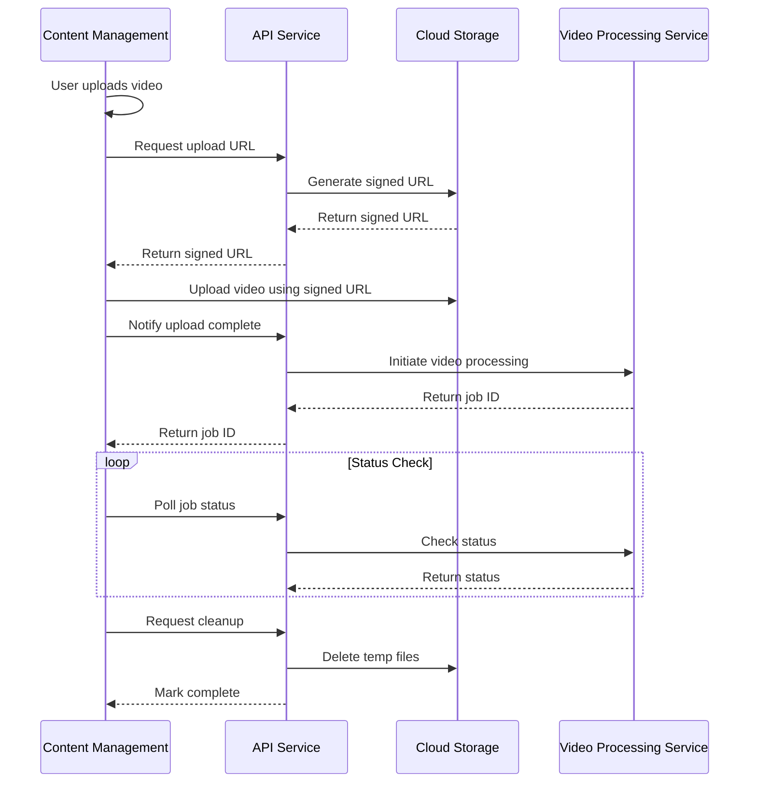

```mermaid
sequenceDiagram
    participant CM as Content Management
    participant API as API Service
    participant CS as Cloud Storage
    participant VP as Video Processing Service

    CM->>CM: User uploads video
    CM->>API: Request upload URL
    API->>CS: Generate signed URL
    CS-->>API: Return signed URL
    API-->>CM: Return signed URL
    CM->>CS: Upload video using signed URL
    CM->>API: Notify upload complete
    API->>VP: Initiate video processing
    VP-->>API: Return job ID
    API-->>CM: Return job ID
    loop Status Check
        CM->>API: Poll job status
        API->>VP: Check status
        VP-->>API: Return status
    end
    CM->>API: Request cleanup
    API->>CS: Delete temp files
    API-->>CM: Mark complete
```
